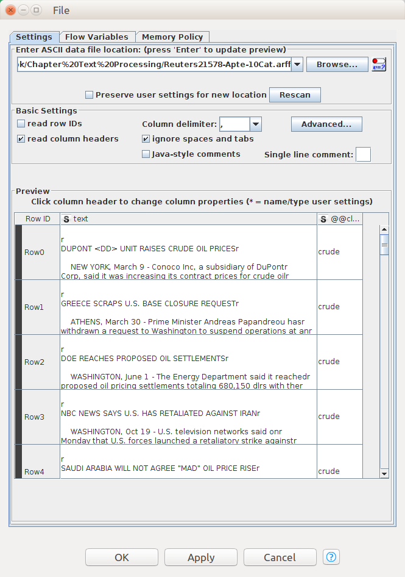
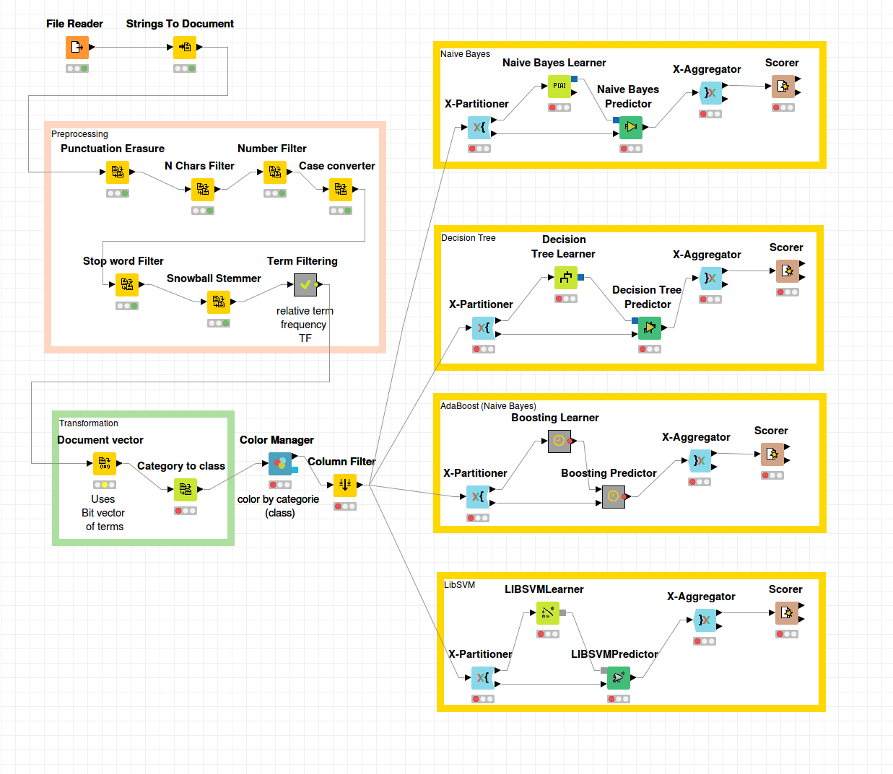

# Chapter 8 - Text Mining and Natural Language Processing

The **Reuters-21578** dataset is used in the experiments in Chapter 8. A zipped copy is available in the *data* folder.

You need to download [KNIME Analytics Platform](https://www.knime.org/knime-analytics-platform) to get started.  In the *expt* folder you will find the KNIME workflow used in the NLP experiments in the book, exported as a *.knwf* file.  It can be imported into KNIME and you can run it as-is or make your own modifications, like configuring additional learners, or using a different base learner with the Boosting model.  

## KNIME Workflow
Once you have installed  **KNIME**, import the KNIME workflow *02_Document_Classification_BIN.knwf*  into the LOCAL KNIME repository.

Normally, you can open the *Configure* dialog by double-clicking any node, but for that to work for all nodes, you must first make sure the first node, **File  Reader**, is configured with the right location of the ARFF data file.  

After the **File Reader** is configured, you can execute the workflow incrementally up to any node you wish and examine the intermediate outputs.  To run any of the classification tasks to completion, simply execute the corresponding **Scorer** node.

In the workflow below, note that the *Transformation* block uses **Binary Term Vector** node.  Only the **Term Filtering** and **Document Vector** nodes need to be re-configured to use __Relative TF Vector__ or __Relative TF Vector with Threshold Filtering__.

## Configuring Relative TF Vector with Threshold Filtering
The screenshot below shows the nested workflow within the **Document Vector** unit for configuring __Relative TF Vector with Threshold Filtering__.

## Configuring the Decision Tree Learner
The **X-Partitioner** node is used to configure the number of cross-validation folds and the sampling method.

## Configuring AdaBoost for Training
**AdaBoost** and other meta-learners are configured separately for training and test.  

 - Training")

## Configuring AdaBoost for Testing
**AdaBoost** is configured with a **Naive Bayes** base learner for predicting the class of the documents in the test set, in addition to being used for training.

 - Prediction")

## Configuring the LIBSVM Learner
Five-fold cross-validation was used for **LIBSVM**, the same as for the other models.

